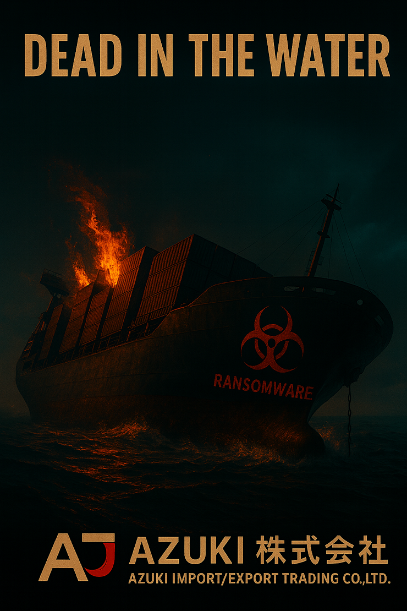

# Threat Hunt Report: Dead In The Water
 

INCIDENT BRIEF - Azuki Import/Export - 梓貿易株式会社
📋 INCIDENT BRIEF - The Azuki Breach Saga - Final Chapter

DATE: November 27, 2025

SITUATION: It's been a week since the initial compromise. You arrive Monday morning to find ransom notes across every system. The threat actors weren't just stealing data - they were preparing for total devastation.

Your CEO needs answers:

How did they get to our backup infrastructure?  
What exactly did they destroy? 
How did the ransomware spread so fast? 
Can we recover? 

The MDE logs are your only source of truth. Piece together the final phase of this attack.

🖥️ Environment

You are investigating the Azuki Logistics corporate network.  
Four systems are in scope for this investigation.  
⚠️ [Azuki Logicitics Network](https://github.com/TonyRamos1982/MiscFiles/blob/main/azuki%20network%20templogy.png)

📄 Evidence - A ransom note was discovered on all encrypted systems.

⚠️ [VIEW RANSOM NOTE](https://www.notion.so/RANSOM-NOTE-2b8cf57416ff8002aea5d5d7d9d60221) 

 # 📖 [**INCIDENT REPORT FILE**](https://docs.google.com/document/d/1fiIq0NpyUBjyDgCjc-VdFRtVuIWUlfhw49t9hq-ZARs/edit?usp=sharing)
